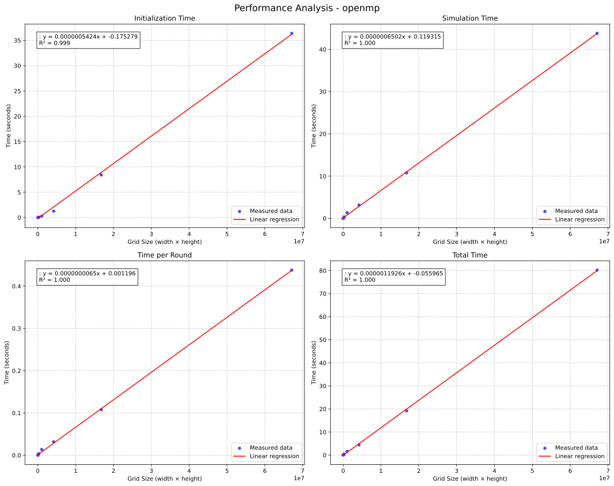
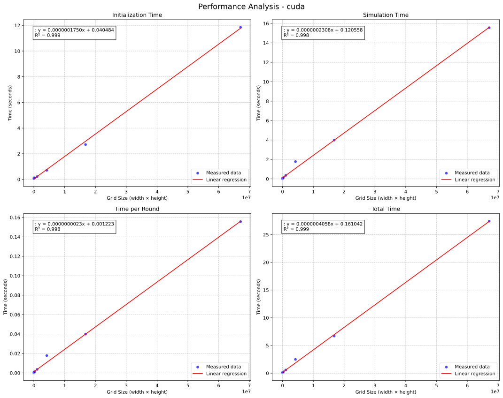

# <center> Laboratoire n°05 {ignore=true}

# <center> Accélération d'une simulation de propagation de pandémie {ignore=true}

## <center>Département : TIC {ignore=true}

## <center>unité d’enseignement CNM {ignore=true}

<br>
<br>
<br>
<br>
<br>
<br>
<br>
<br>
<br>
<br>
<br>
<br>
<br>
<br>

Auteur: **André Costa & Alexandre Iorio**

Professeur: **Marina Zapater**

Assistant : **Mehdi Akeddar**

Salle de labo : **A09**

Date : **29.01.2025**


<!--pagebreak-->

## <center>Table des matières {ignore=true}

<!-- @import "[TOC]" {cmd="toc" depthFrom=1 depthTo=4 orderedList=false} -->

<!-- code_chunk_output -->

- [0. Introduction](#0-introduction)
- [1. Objectifs](#1-objectifs)
- [2. Description de l'application](#2-description-de-lapplication)
- [3. Analyse des performances de l'applicaton](#3-analyse-des-performances-de-lapplicaton)
- [4. Identification des goulets d'étranglement](#4-identification-des-goulets-détranglement)
  - [4.1 Détermination du nombre de cellules à vérifier](#41-détermination-du-nombre-de-cellules-à-vérifier)
    - [4.1.1 Cellule Healthy et Immune](#411-cellule-healthy-et-immune)
    - [4.1.2 Cellule Infected, Dead et Empty](#412-cellule-infected-dead-et-empty)
  - [4.2 Détermination du nombre de cellules à initialiser](#42-détermination-du-nombre-de-cellules-à-initialiser)
  - [4.3 Nombre total d'opérations](#43-nombre-total-dopérations)
  - [4.4 Solution pour accélérer l'application](#44-solution-pour-accélérer-lapplication)
    - [4.4.1 Parallélisation avec OpenMP](#441-parallélisation-avec-openmp)
    - [4.4.2 Parallélisation avec Cuda](#442-parallélisation-avec-cuda)
  - [4.5 Comparaison des performances](#45-comparaison-des-performances)
    - [4.5.1 OpenMP](#451-openmp)
    - [4.5.2 Cuda](#452-cuda)
    - [4.5.3 Comparaison entre les versions](#453-comparaison-entre-les-versions)
- [5. Identification des améliorations possibles](#5-identification-des-améliorations-possibles)
- [6. Conclusion](#6-conclusion)

<!-- /code_chunk_output -->

<!-- pagebreak -->


## 0. Introduction

Ce laboratoire à pour but de d'accélerer une application demandant beaucoup de ressources en utilisant le parallélisme. Nous allons appliquer les concepts vus en cours pour accélérer une simulation de propagation de pandémie.
Toute les simulations sont éxécutées sur un serveur sur le matériel suivant:

```bash
cnm@cnm-desktop 
--------------- 
OS: Ubuntu 20.04.6 LTS aarch64 
Host: NVIDIA Orin Nano Developer Kit 
Kernel: 5.10.216-tegra 
Packages: 2138 (dpkg) 
Shell: bash 5.0.17 
Terminal: /dev/pts/2 
CPU: ARMv8 rev 1 (v8l) (6) @ 1.510GHz 
Memory: 1542MiB / 7451MiB 
```
et les caractéristiques `GPU` suivantes:

| Field                   | Value                 |
| ----------------------- | --------------------- |
| Device Name             | Orin                  |
| CUDA driver version     | 11.4                  |
| CUDA runtime version    | 11.4                  |
| CUDA Capability version | 8.7                   |
| Multiprocesors (MP)     | 8                     |
| CUDA cores/MP           | 128                   |
| Total CUDA cores        | 1024                  |
| GPU Max clock rate      | 624 MHz               |
| Global Memory           | 7451 MBytes           |
| Shared memory/block     | 49152 bytes           |
| Registers/block         | 65536                 |
| L2 Cache size           | 2097152 bytes         |
| Warp size               | 32                    |
| Max threads/block       | 1024                  |
| Max dim thread block    | x: 1024, y:1024, z:64 |


## 1. Objectifs

- Implémenter une programme de simulation de propagation de pandémie demandant beaucoup de ressources
- Analiser les performances de l'application
- Identifier les goulets d'étranglement de l'application
- Paralléliser l'application avec `OpenMP`
- Analyser les performances de l'application parallélisée avec `OpenMP`
- Paralléliser l'application avec `Cuda`
- Analyser les performances de l'application parallélisée avec `Cuda`
- Comparer les performances des trois versions de l'application
- Identifier les améliorations possibles

## 2. Description de l'application

L'application `simple-plague-simulation` disponible sur le dépôt `git` [simple-plague-simulator](https://github.com/AlexandreIorio/simple-plague-simulator.git) est une simulation de propagation de pandémie.
Son fonctionnement est simple, initialiser une `Grid 2D` de taille `N x N` avec un pourcentage d'occupation.
Chaque cellule de la grille peut être dans un des états suivants: `EMPTY`, `HEALTY`, `INFECTED`, `DEAD` ou `IMMUNE`.
Nous décidons du nombre de personne à infécter au début de la simulation et chaque tour nous calculons les nouvelles infections en fonction des paramêtres saisis. 
Une fois que plus personne n'est infecté, la simulation s'arrête et un rapport est généré.

**Exemple**
```bash
-----------------------------------
         Plague Simulator
-----------------------------------
Runtime : CPU
------------------------------------
Parameters
------------------------------------
Population                  : 50 %
World height                : 256
World Width                 : 256
World size                  : 65536
Proximity                   : 2
Infection duration          : 10 turns
Healthy infection probability:10 % 
Immune infection probability: 1 % 
Death probability           : 10 %
Initial infected            : 1
Population immunized        : 0%

-----------------------------------
         Initialisation
-----------------------------------
Initializing World ...
Initialization Duration: 0.00162655 s
------------------------------------
Initial world :
------------------------------------
Number of healthy people  : 32767
Number of infected people : 1
Number of immunized people: 0

------------------------------------
Simulation
------------------------------------
Simulation started
Round 0
Round 10
Round 20
Round 30
Round 40
Round 50
...
...
Round 510
Round 520
------------------------------------
Saving Timeline
Timeline created
Initialization took       : 0.00162655 s
Simulation took           : 1.17238 s
Total Time                : 1.174 s
Number of turns           : 523
Number of healthy people  : 429
Number of immunized people: 28281
Number of survivor        : 28710
Number of dead people     : 4058
```

## 3. Analyse des performances de l'applicaton
Dans un premier temps, nous avons tenté de mesurer les performances de l'application lancant simplement la simulation avec différentes tailles de grille.

Voici un graphique représentant le temps d'éxécution de la simulation en fonction de la taille de la grille:


**Analyse**: Sur ce graphique, nous remarquons que le temps d'éxécution de la simulation augmente de manière linéaire avec un `R²` de `1` pour le temps de simulation, le temps par tour et le temps total. Quant à l'initialisation, le `R²` est de `0.995` ce qui signifie que le temps d'initialisation et moins prévisible mais reste relativement linéaire. Le compilateur semble optimiser le code pour les tailles de grille plus petites.

## 4. Identification des goulets d'étranglement
En fonction de l'état de la cellule, le principe de l'application est de verifier les voisins de chaque avec un `radius` qui est representé par le paramêtre `proximity`. 
C'est à dire, pour un paramètre proximity de `2`, nous devons vérifier, dans certains cas, les voisins dans un carré de `5x5` autour de la cellule.

### 4.1 Détermination du nombre de cellules à vérifier

#### 4.1.1 Cellule Healthy et Immune

Pour une cellule `HEALTHY` et `IMUNNE`, nous devons vérifier si un voisin est `INFECTED` et si la probabilité d'infection est respectée.

.

Afin de déterminer le nombre de cellules à vérifier nous avons la formule suivante:

$$ Cells = (2 * proximity + 1)² $$. 

Maintenant, appliquons cette formule à une `Grid 2D` de taille `256x256` avec un `proximity` de `2`, avec un taux d'occupation de `50%` et 1 `INFECTED`. Analyse pour le premier tour:

$$ Grid_{size} = 256 * 256 = 65'536 $$
$$ Cells_{healthy} = Grid_{size} * 50\% = 32'768 $$
$$ Cells_{neighbours} = 5 * 5 = 25 $$
$$ Total_{NeighboursAnalysis} = Cells_{healthy} * Cells_{neighbours} = 819'200 $$
$$ Total_{cellsToCheck} = Total_{NeighboursAnalysis} + Grid_{size} = 884'736 $$
$$ Part_{NeighboursAnalysis} = \frac{Total_{NeighboursAnalysis}}{Total_{cellsToCheck}} = 92.5\% $$

En augmentant le `proximity` ou la taille de la `grid`, le nombre de cellules à vérifier augmente de manière exponentielle.

Analysons maintenant avec une `Grid 2D` de taille `4096 x 4096` toujours avec un `proximity` de `2` et un taux d'occupation de `50%` et 1 `INFECTED`. Analyse pour le premier tour:

$$ Grid_{size} = 4096 * 4096 = 16'777'216 $$
$$ Cells_{healthy} = Grid_{size} * 50\% = 8'388'608 $$
$$ Cells_{neighbours} = 5 * 5 = 25 $$
$$ Total_{NeighboursAnalysis} = Cells_{healthy} * Cells_{neighbours} = 209'715'200 $$
$$ Total_{cellsToCheck} = Total_{NeighboursAnalysis} + Grid_{size} = 226'492'416 $$
$$ Part_{NeighboursAnalysis} = \frac{Total_{NeighboursAnalysis}}{Total_{cellsToCheck}} = 92.5\% $$

Tout au long du dérouement du programme, la proportion de cellules va changer. En effet certaines cellule qui était `HEALTHY` vont devenir `INFECTED` et donc ne plus être analysées, puis peut-être devenir `IMMUNE` et continuer à être analysées, ou alors devenir `DEAD` et ne plus être analysées, jusqu'à la fin de la simulation.

De ce fait, nous pouvons dire que le nombre d'opérations, pour des paramètres `standard`, à une tendance à la baisse.

#### 4.1.2 Cellule Infected, Dead et Empty

Pour une cellule `INFECTED`, nous devons simplement vérifier si la durée d'infection est atteinte et si c'est le cas, la cellule devient `DEAD` ou `IMMUNE`.

Pour les cellules `DEAD` et `EMPTY`, nous devons simplement verifier leur status. 

Nous somme sur un algorithme de complexité `O(n)`.


Afin de déterminer le nombre de cellules à vérifier nous avons la formule suivante:

$$ Total_{cellsToCheck} = N * N $$

Maintenant, appliquons cette formule à une `Grid 2D` de différentes tailles.

$$ Grid_{size} = 256 * 256 = 65'536 $$
$$ Grid_{size} = 1024 * 1024 = 1'048'576 $$
$$ ... $$
$$ Grid_{size} = 4096 * 4096 = 16'777'216 $$

En augmentant la taille de la `grid`, le nombre de cellules à vérifier augmente linéairement par dimension et au carré pour la `grid`.

### 4.2 Détermination du nombre de cellules à initialiser

Afin de pouvoir jouer une simulation, il faut, dans un premier temps, initialiser la `grid` avec un taux d'occupation.

Afin de déterminer le nombre de cellules à initialiser nous avons la formule suivante:

$$ Cells_{toInitialize} = N * N $$

Maintenant, appliquons cette formule à une `Grid 2D` de différentes tailles.

$$ Grid_{size} = 256 * 256 = 65'536 $$
$$ Grid_{size} = 1024 * 1024 = 1'048'576 $$
$$ ... $$
$$ Grid_{size} = 4096 * 4096 = 16'777'216 $$

En augmentant la taille de la `grid`, le nombre de cellules à initialiser augmente linéairement par dimension et au carré pour la `grid`.

### 4.3 Nombre total d'opérations

//TODO

### 4.4 Solution pour accélérer l'application

Afin de paralléliser l'application, nous avons immaginé la solution suivante. 
Celle de passer une cellule ou un groupe de cellules de la `grid` à chaque thread.

#### 4.4.1 Parallélisation avec OpenMP

Notre première approche a été celle de paralléliser l'application avec `OpenMP`. 

De cette manière. nous pouvons remettre la charge de travail sur plusieurs coeurs de la `CPU`. 

Chaque thread va allors s'ocucper d'une partie de la `grid` pour les différentes tâches à effectuer.

##### 4.4.1.1 Initialisation


Pour l'initialisation, nous divisons la `grid` en `nb_chunk` parties de manière à initialiser sans conflit les cellules de la `grid`.

Voici in exemple pour `nb_chunk = 4`


De cette manière, les `threads` initialisent les cellules de la `grid` sans conflit.


##### 4.4.1.2 Simulation

//TODO

#### 4.4.2 Parallélisation avec Cuda

Notre deuxième approche a été celle de paralléliser l'application avec `Cuda`.
Cette approche différente de la première, nous permet de paralléliser l'application sur le `GPU`. Ainsi, comme nous avons un très grand nombre de `threads` sur le `GPU`, nous pouvons affecter un thread par cellule de la `grid`.

De cette manière, un thread fera un nombre de vérifications maximum de $ Cells_{neighbours} = (2 * proximity + 1)² $
 pour les cellules `HEALTHY` et `IMMUNE` et un nombre de vérification de `1` pour les cellules `INFECTED`, `DEAD` et `EMPTY`.

##### 4.4.2.1 Initialisation

L'initialisation avec `Cuda` est plus complexe que celle avec `OpenMP`. En effet, pour attribuer des cellules de manières aléatoires, nous devons utiliser une grille d'occupation. de cette manière, quand un thread veut ecrire sur une cellule, il peut verifier si la cellule est déjà occupée ou non, et si elle ne l'est pas, il peut l'occuper, et ce, de manière `atomique`.

##### 4.4.2.2 Simulation

Pour la simulation, la methode utilisée avec `Cuda` est bien plus simple, chaque thread va verifier les voisins de la cellule qu'il occupe et effectuer les actions necessaires, modifier un tableau temporaire et ensuite copier le tableau temporaire dans le tableau principal.

### 4.5 Comparaison des performances

#### 4.5.1 OpenMP

Maintenant que la solution est implémentée, voyons les performances de l'application parallélisée avec `OpenMP` grace à un graphique suivant:



**Analyse**: Sur ce graphique, nous remarquons que le temps augmente de façon linéaire. Avec un `R²` de `~1` pour tous les parties de a simulation, on voit que le temps de simulation total est prévisible. La durée quant à elle nettement améliorée quant à la version [`CPU` standard](#3-analyse-des-performances-de-lapplicaton).


On remarque très clairement que le temps d'initialisation avec `OpenMP` est plus élevé que sur la version `CPU` standard. Cela est dû au fait que `OpenMP` doit initialiser les `threads` et les `chunk` de la `grid` avant de pouvoir commencer l'initialisation.

Bien que la tendance est à la baisse, l'initialisation par `OpenMP` n'est pas une bonne solution. On remarque que pour une taille de `8192 x 8192`, le temps d'initialisation est plus long de ~59% par rapport à la version `CPU` standard. Si on pouvait suivre la tendance, on aurait une grid de dimensions bien trop élevée pour une execution sur une `Jetson Nano`.

En revanche, le temps de simulation augmente très rapidement avec la dimension de la `grid`. Quant bien même, pour une grid de `64 x 64` le temps est moins élevé, une `grid` de `8192 x 8192` est 460% plus rapide que la version `CPU` standard. 

Cette tendance est la même pour le temps par tour. 

Quant au temps total, il est fortement pégoré par le temps d'initialisation.

#### 4.5.2 Cuda

La solution implémentée avec `Cuda` aussi très performante. Voici un graphique représentant les performances de l'application parallélisée avec `Cuda`:



**Analyse** : Pour une même `grid` de `8192 x 8192`, le temps total est drastiquement réduit. 
Le temps de simulation est tout aussi estimable avec un `R²` très proche de `1`.

Voici une comparision des performances entre la version `CPU` standard, OpenMP et la version `Cuda`:


#### 4.5.3 Comparaison entre les versions

Afin de nous rentre compte des performances de chaque version, voici un graphique superposant les trois versions:


On remarque bien les performances de chaque version. La version `Cuda` est la plus performante, suivie de la version `OpenMP` et enfin la version `CPU` standard.

Cependant, lorsque l'on zoom sur les performances avec des petites `grid`, on se rend compte que les processus d'initialisation est fortement impacté. 


La version `Cuda` est alors la plus défavorables. Cela est du à la copie des données entre la `CPU` et le `GPU`. En effet, pour des petites `grid`, le temps de copie est plus long que le temps d'éxécution de la simulation. Alors que pour des `grid`dans les alentours de `800 x 800`, la version `Cuda`devient plus performante que la version `OpenMP`. Cuda rejoindra les performances de la version `CPU` standard pour des `grid` dans les alentours de `4000 x 4000`.

Afin de bien se rendre compte des vitesse d'éxécution, voici un tableau comparatif des `grid` allant de `4 x 4` à `8192 x 8192`:

##### 4.5.3.1 Comparaison des temps d'initialisation

**Différences absolues (secondes)**
`targetA - targetB`

| grid_size   |   OpenMP - STD |   CUDA - STD |   CUDA - OpenMP |
|:------------|---------------:|-------------:|----------------:|
| 4x4         |          0.000 |        0.123 |           0.123 |
| 8x8         |          0.000 |        0.069 |           0.068 |
| 16x16       |          0.000 |        0.066 |           0.065 |
| 32x32       |          0.001 |        0.067 |           0.067 |
| 64x64       |          0.001 |        0.068 |           0.066 |
| 128x128     |          0.004 |        0.067 |           0.062 |
| 256x256     |          0.015 |        0.071 |           0.056 |
| 512x512     |          0.055 |        0.114 |           0.058 |
| 1024x1024   |          0.226 |        0.178 |          -0.048 |
| 2048x2048   |          1.024 |        0.477 |          -0.547 |
| 4096x4096   |          5.592 |       -0.113 |          -5.705 |
| 8192x8192   |         21.759 |       -2.790 |         -24.549 |

**Ratio de vitesse**

`TargetA VS TargetB` veut dire que `TargetA` est `x` fois plus rapide que `TargetB`

| grid_size   | OpenMP vs STD   | CUDA vs STD   | CUDA vs OpenMP   |
|:------------|:----------------|:--------------|:-----------------|
| 4x4         | 0.02x           | 0.00x         | 0.00x            |
| 8x8         | 0.03x           | 0.00x         | 0.00x            |
| 16x16       | 0.02x           | 0.00x         | 0.01x            |
| 32x32       | 0.05x           | 0.00x         | 0.01x            |
| 64x64       | 0.08x           | 0.00x         | 0.02x            |
| 128x128     | 0.08x           | 0.01x         | 0.07x            |
| 256x256     | 0.10x           | 0.02x         | 0.23x            |
| 512x512     | 0.12x           | 0.06x         | 0.52x            |
| 1024x1024   | 0.14x           | 0.17x         | 1.22x            |
| 2048x2048   | 0.18x           | 0.33x         | 1.77x            |
| 4096x4096   | 0.34x           | 1.04x         | 3.10x            |
| 8192x8192   | 0.40x           | 1.24x         | 3.07x            |

##### 4.5.3.2 Comparaison des temps de simulation

**Différences absolues (secondes)**

`targetA - targetB`

| grid_size | OpenMP - STD | CUDA - STD | CUDA - OpenMP |
| :-------- | -----------: | ---------: | ------------: |
| 4x4       |        0.001 |      0.005 |         0.004 |
| 8x8       |        0.001 |      0.007 |         0.006 |
| 16x16     |        0.015 |      0.008 |        -0.008 |
| 32x32     |        0.008 |      0.014 |         0.005 |
| 64x64     |        0.003 |      0.046 |         0.044 |
| 128x128   |       -0.038 |      0.014 |         0.051 |
| 256x256   |       -0.153 |     -0.145 |         0.009 |
| 512x512   |       -0.603 |     -0.833 |        -0.230 |
| 1024x1024 |       -2.476 |     -3.479 |        -1.003 |
| 2048x2048 |      -12.117 |    -13.505 |        -1.388 |
| 4096x4096 |      -50.345 |    -57.126 |        -6.781 |
| 8192x8192 |     -201.829 |   -230.053 |       -28.224 |


**Ratio de vitesse**

`TargetA VS TargetB` veut dire que `TargetA` est `x` fois plus rapide que `TargetB`

| grid_size   | OpenMP vs STD   | CUDA vs STD   | CUDA vs OpenMP   |
|:------------|:----------------|:--------------|:-----------------|
| 4x4         | 0.01x           | 0.00x         | 0.24x            |
| 8x8         | 0.09x           | 0.01x         | 0.15x            |
| 16x16       | 0.05x           | 0.09x         | 1.90x            |
| 32x32       | 0.23x           | 0.15x         | 0.67x            |
| 64x64       | 0.85x           | 0.24x         | 0.29x            |
| 128x128     | 2.72x           | 0.81x         | 0.30x            |
| 256x256     | 2.80x           | 2.54x         | 0.91x            |
| 512x512     | 2.68x           | 7.49x         | 2.80x            |
| 1024x1024   | 2.81x           | 10.59x        | 3.76x            |
| 2048x2048   | 4.82x           | 8.56x         | 1.78x            |
| 4096x4096   | 5.67x           | 15.32x        | 2.70x            |
| 8192x8192   | 5.61x           | 15.78x        | 2.81x            |

##### 4.5.3.3 Comparaison des temps par tours

**Différences absolues (secondes)**
`targetA - targetB`

| grid_size   |   OpenMP - STD |   CUDA - STD |   CUDA - OpenMP |
|:------------|---------------:|-------------:|----------------:|
| 4x4         |          0.000 |        0.000 |           0.000 |
| 8x8         |          0.000 |        0.000 |           0.000 |
| 16x16       |          0.000 |        0.000 |          -0.000 |
| 32x32       |          0.000 |        0.000 |           0.000 |
| 64x64       |          0.000 |        0.000 |           0.000 |
| 128x128     |         -0.000 |        0.000 |           0.001 |
| 256x256     |         -0.002 |       -0.001 |           0.000 |
| 512x512     |         -0.006 |       -0.008 |          -0.002 |
| 1024x1024   |         -0.025 |       -0.035 |          -0.010 |
| 2048x2048   |         -0.121 |       -0.135 |          -0.014 |
| 4096x4096   |         -0.503 |       -0.571 |          -0.068 |
| 8192x8192   |         -2.018 |       -2.301 |          -0.282 |

**Ratio de vitesse**

`TargetA VS TargetB` veut dire que `TargetA` est `x` fois plus rapide que `TargetB`

| grid_size   | OpenMP vs STD   | CUDA vs STD   | CUDA vs OpenMP   |
|:------------|:----------------|:--------------|:-----------------|
| 4x4         | 0.03x           | 0.01x         | 0.25x            |
| 8x8         | 0.13x           | 0.02x         | 0.15x            |
| 16x16       | 0.06x           | 0.07x         | 1.25x            |
| 32x32       | 0.34x           | 0.22x         | 0.67x            |
| 64x64       | 0.85x           | 0.24x         | 0.29x            |
| 128x128     | 2.72x           | 0.81x         | 0.30x            |
| 256x256     | 2.80x           | 2.54x         | 0.91x            |
| 512x512     | 2.68x           | 7.49x         | 2.80x            |
| 1024x1024   | 2.81x           | 10.59x        | 3.76x            |
| 2048x2048   | 4.82x           | 8.56x         | 1.78x            |
| 4096x4096   | 5.67x           | 15.32x        | 2.70x            |
| 8192x8192   | 5.61x           | 15.78x        | 2.81x            |

##### 4.5.3.4 Comparaison des temps totaux

**Différences absolues (secondes)**

`targetA - targetB`

| grid_size   |   OpenMP - STD |   CUDA - STD |   CUDA - OpenMP |
|:------------|---------------:|-------------:|----------------:|
| 4x4         |          0.001 |        0.128 |           0.126 |
| 8x8         |          0.001 |        0.075 |           0.074 |
| 16x16       |          0.016 |        0.074 |           0.058 |
| 32x32       |          0.009 |        0.081 |           0.072 |
| 64x64       |          0.004 |        0.114 |           0.110 |
| 128x128     |         -0.033 |        0.081 |           0.114 |
| 256x256     |         -0.138 |       -0.073 |           0.065 |
| 512x512     |         -0.547 |       -0.719 |          -0.172 |
| 1024x1024   |         -2.250 |       -3.301 |          -1.051 |
| 2048x2048   |        -11.093 |      -13.028 |          -1.935 |
| 4096x4096   |        -44.752 |      -57.239 |         -12.486 |
| 8192x8192   |       -180.071 |     -232.843 |         -52.773 |

**Ratio de vitesse**

`TargetA VS TargetB` veut dire que `TargetA` est `x` fois plus rapide que `TargetB`

| grid_size   | OpenMP vs STD   | CUDA vs STD   | CUDA vs OpenMP   |
|:------------|:----------------|:--------------|:-----------------|
| 4x4         | 0.02x           | 0.00x         | 0.01x            |
| 8x8         | 0.08x           | 0.00x         | 0.02x            |
| 16x16       | 0.04x           | 0.01x         | 0.22x            |
| 32x32       | 0.22x           | 0.03x         | 0.14x            |
| 64x64       | 0.79x           | 0.12x         | 0.15x            |
| 128x128     | 2.25x           | 0.43x         | 0.19x            |
| 256x256     | 2.35x           | 1.44x         | 0.61x            |
| 512x512     | 2.30x           | 3.89x         | 1.69x            |
| 1024x1024   | 2.38x           | 6.73x         | 2.82x            |
| 2048x2048   | 3.50x           | 6.22x         | 1.78x            |
| 4096x4096   | 3.33x           | 9.54x         | 2.86x            |
| 8192x8192   | 3.25x           | 9.49x         | 2.92x            |


## 5. Identification des améliorations possibles

Nous avons decidé, à chaque fois, de paralleliser la totalité de l'application avec `OpenMP` et `Cuda`. Cependant, après analyse, ont pourrait améliorer en sélectionnant la technologies 
en fonction de la taille de la `grid`.

Avec `Cuda` une optimisation qui accélérerait encore plus l'application ce serait d'utiliser la technique de `stencil` pour la simulation. En effet, pour chaque cellule, nous devons vérifier les voisins. En utilisant cette technique, on diminurait le nombre d'accès à la mémoire globale de la `GPU` et donc augmenterait les performances.

## 6. Conclusion

//TODO