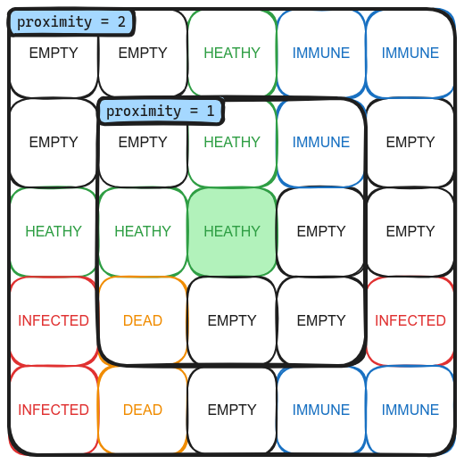
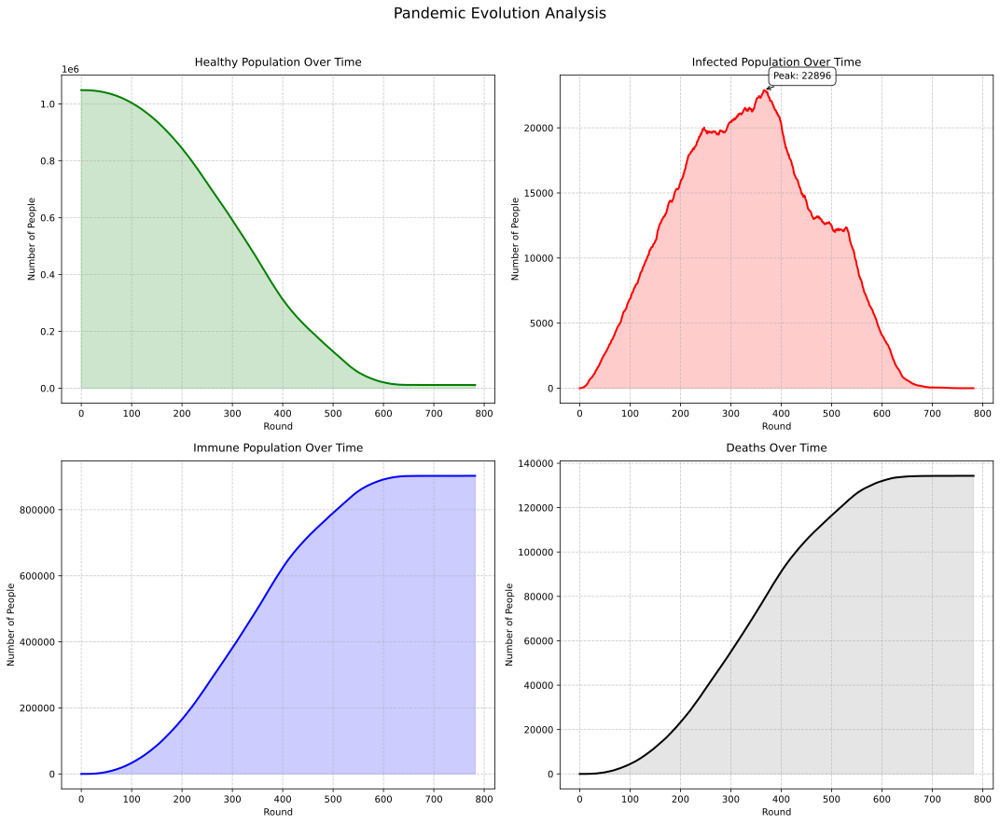
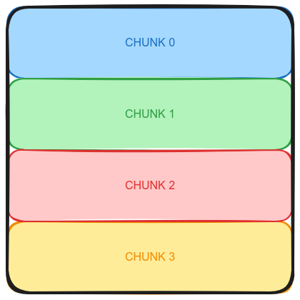
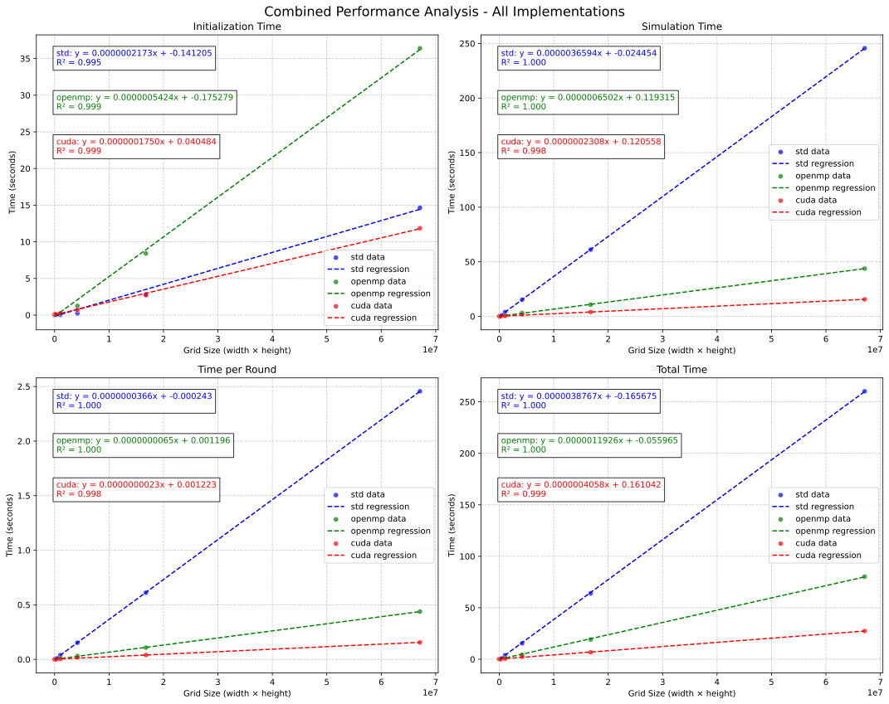
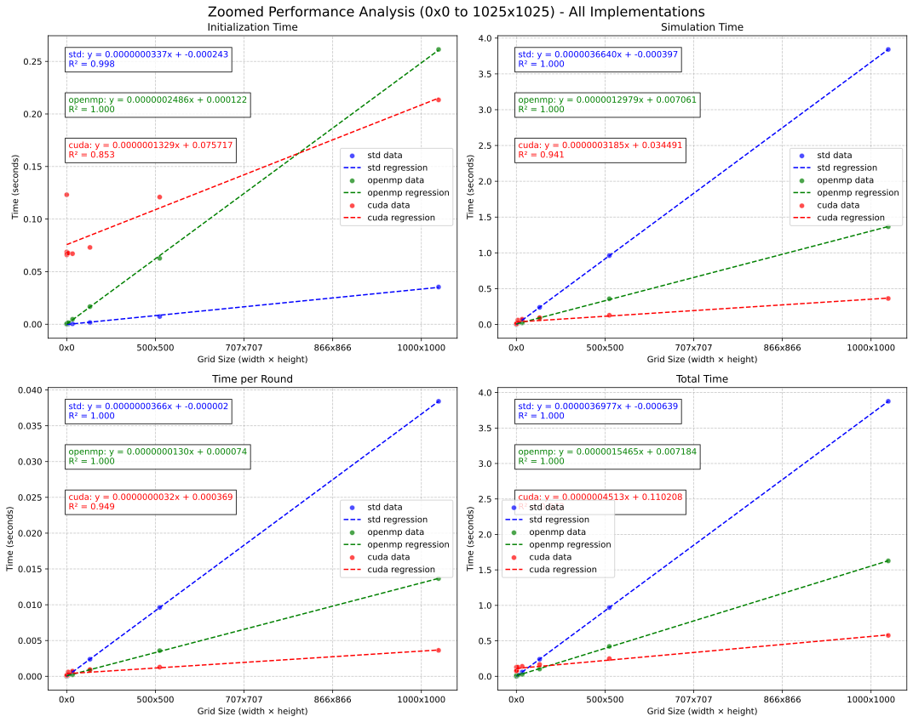

# <center> Laboratoire n°05 {ignore=true}

# <center> Accélération d'une simulation de propagation de pandémie {ignore=true}

## <center>Département : TIC {ignore=true}

## <center>unité d’enseignement CNM {ignore=true}

<br>
<br>
<br>
<br>
<br>
<br>
<br>
<br>
<br>
<br>
<br>
<br>
<br>
<br>

Auteur: **André Costa & Alexandre Iorio**

Professeur: **Marina Zapater**

Assistant : **Mehdi Akeddar**

Salle de labo : **A09**

Date : **29.01.2025**


<!--pagebreak-->

## <center>Table des matières {ignore=true}

<!-- @import "[TOC]" {cmd="toc" depthFrom=1 depthTo=4 orderedList=false} -->

<!-- code_chunk_output -->

- [0. Introduction](#0-introduction)
- [1. Objectifs](#1-objectifs)
- [2. Description de l'application](#2-description-de-lapplication)
  - [2.1 Initialisation](#21-initialisation)
  - [2.2 Tour de simulation](#22-tour-de-simulation)
- [3. Analyse des performances de l'applicaton](#3-analyse-des-performances-de-lapplicaton)
- [4. Identification des goulets d'étranglement](#4-identification-des-goulets-détranglement)
  - [4.1 Déterminations du nombre de cellules à vérifier](#41-déterminations-du-nombre-de-cellules-à-vérifier)
    - [4.1.1 Cellule healthy et immune](#411-cellule-healthy-et-immune)
    - [4.1.2 Cellule Infected, Dead et Empty](#412-cellule-infected-dead-et-empty)
  - [4.2 Déterminations du nombre de cellules à initialiser](#42-déterminations-du-nombre-de-cellules-à-initialiser)
  - [4.3 Nombre total d'opérations](#43-nombre-total-dopérations)
  - [4.4 Solution pour accélérer l'application](#44-solution-pour-accélérer-lapplication)
    - [4.4.1 OpenMP](#441-openmp)
    - [4.4.2 CUDA](#442-cuda)
  - [4.5 Comparaison des performances](#45-comparaison-des-performances)
    - [4.5.1 Comparaisons des initialisations](#451-comparaisons-des-initialisations)
    - [4.5.2 Comparaisons des temps de simulation total de la pandémie](#452-comparaisons-des-temps-de-simulation-total-de-la-pandémie)
- [5. Autres optimisations effectuées](#5-autres-optimisations-effectuées)
  - [5.1 Utilisation du bon type pour les états](#51-utilisation-du-bon-type-pour-les-états)
  - [5.2 Encodage RLE pour la sauvegarde de la timeline](#52-encodage-rle-pour-la-sauvegarde-de-la-timeline)
  - [5.3 Utilisation de pointeurs](#53-utilisation-de-pointeurs)
- [6. Identification des améliorations possibles](#6-identification-des-améliorations-possibles)
- [7. Conclusion](#7-conclusion)

<!-- /code_chunk_output -->

<!-- pagebreak -->


## 0. Introduction

Ce laboratoire a pour but d'accélérer une application demandant beaucoup de ressources en utilisant le parallélisme. Nous allons appliquer les concepts vus en cours pour accélérer une simulation de propagation de pandémie.
Toutes les simulations sont exécutées sur un serveur avec le matériel suivant :

```bash
cnm@cnm-desktop 
--------------- 
OS: Ubuntu 20.04.6 LTS aarch64 
Host: NVIDIA Orin Nano Developer Kit 
Kernel: 5.10.216-tegra 
Packages: 2138 (dpkg) 
Shell: bash 5.0.17 
Terminal: /dev/pts/2 
CPU: ARMv8 rev 1 (v8l) (6) @ 1.510GHz 
Memory: 1542MiB / 7451MiB 
```
et les caractéristiques `GPU` suivantes:

| Field                   | Value                 |
| ----------------------- | --------------------- |
| Device Name             | Orin                  |
| CUDA driver version     | 11.4                  |
| CUDA runtime version    | 11.4                  |
| CUDA Capability version | 8.7                   |
| Multiprocesors (MP)     | 8                     |
| CUDA cores/MP           | 128                   |
| Total CUDA cores        | 1024                  |
| GPU Max clock rate      | 624 MHz               |
| Global Memory           | 7451 MBytes           |
| Shared memory/block     | 49152 bytes           |
| Registers/block         | 65536                 |
| L2 Cache size           | 2097152 bytes         |
| Warp size               | 32                    |
| Max threads/block       | 1024                  |
| Max dim thread block    | x: 1024, y:1024, z:64 |


## 1. Objectifs

- Implémenter un programme de simulation de propagation de pandémie demandant beaucoup de ressources
- Analyser les performances de l'application
- Identifier les goulets d'étranglement de l'application
- Paralléliser l'application avec OpenMP
- Analyser les performances de l'application parallélisée avec OpenMP
- Paralléliser l'application avec Cuda
- Analyser les performances de l'application parallélisée avec Cuda
- Comparer les performances des trois versions de l'application
- Identifier les améliorations possibles

## 2. Description de l'application

L'application `plague-simulator` disponible sur le dépôt `git` [simple-plague-simulator](https://github.com/AlexandreIorio/simple-plague-simulator.git) est une simulation de propagation de pandémie.

Cette application est décomposée en 2 parties, l'initialisation et la simulation.

### 2.1 Initialisation

L'initialisation implique la création de la `grid` avec la taille demandée et de la peupler les cellules selon un état prédéfinit.

A savoir: 

- `Healthy` pour un état sain
- `Infected` pour un état malade
- `Immune` pour un état immunisée
- `Dead` pour un état mort 
- `Empty` pour une cellule vide

L'idée est de garder un facteur aléatoire sur l'affectation initiale des cellules, tout en s'assurant que chaque cellule est affectée indépendamment. 


### 2.2 Tour de simulation

Un tour de simulation consiste à recalculer l'état de chaque cellule en fonction de l'état actuel et de ses voisins.

Pour les états `Dead` et `Empty`, il n'y a rien à faire.

Pour les états `Healthy` et `Immune`, on vérifie si la cellule est à proximité d'une cellule ayant un état `Infected`. Si tel est le cas, on la marque comme `Infected` selon une probabilité.

Les probabilités d'infection sont différentes pour l'état `Healthy` et `Immune`, selon les paramètres de la simulation.

Pour l'état `Infected`, une fois le nombre de tours atteint, on vérifie si la cellule devient `Dead` ou `Immune` selon une probabilité.


**Exemple**
```bash
-----------------------------------
         Plague Simulator
-----------------------------------
Runtime : CPU
------------------------------------
Parameters
------------------------------------
Population                  : 50 %
World height                : 256
World Width                 : 256
World size                  : 65536
Proximity                   : 2
Infection duration          : 10 turns
Healthy infection probability:10 % 
Immune infection probability: 1 % 
Death probability           : 10 %
Initial infected            : 1
Population immunized        : 0%

-----------------------------------
         Initialisation
-----------------------------------
Initializing World ...
Initialization Duration: 0.00162655 s
------------------------------------
Initial world :
------------------------------------
Number of healthy people  : 32767
Number of infected people : 1
Number of immunized people: 0

------------------------------------
Simulation
------------------------------------
Simulation started
Round 0
Round 10
Round 20
Round 30
Round 40
Round 50
...
...
Round 510
Round 520
------------------------------------
Saving Timeline
Timeline created
Initialization took       : 0.00162655 s
Simulation took           : 1.17238 s
Total Time                : 1.174 s
Number of turns           : 523
Number of healthy people  : 429
Number of immunized people: 28281
Number of survivor        : 28710
Number of dead people     : 4058
```

## 3. Analyse des performances de l'applicaton
Dans un premier temps, nous avons tenté de mesurer les performances de l'application lançant simplement la simulation avec différentes tailles de grille.

Voici un graphique représentant le temps d'exécution de la simulation en fonction de la taille de la grille:


**Analyse**: Sur ce graphique, nous remarquons que le temps d'exécution de la simulation augmente de manière linéaire avec un `R²` de `1` pour le temps de simulation, le temps par tour et le temps total. Quant à l'initialisation, le `R²` est de `0.995` ce qui signifie que le temps d'initialisation est moins prévisible, mais reste relativement linéaire. Le compilateur semble optimiser le code pour les tailles de grille plus petites.

## 4. Identification des goulets d'étranglement

Pour déterminer le premier goulet d'étranglement, nous allons nous pencher sur le principe de fonctionnement de l'algorithme de propagation de pandémie.

Le nombre d'opérations par cellule `HEALTHY` et `IMMUNE` est de $(2 * proximity + 1)² - 1$ et pour les cellules `INFECTED`, `DEAD` et `EMPTY` est de `1`.

En effet, pour les cellules `HEALTHY` et `IMMUNE`, nous devons vérifier les voisins sur une distance représentée par le paramètre `proximity`, et déterminer si la cellule doit changer d'état.

Nous allons maintenant analyser le nombre d'opérations à effectuer pour chaque état de cellule.

### 4.1 Déterminations du nombre de cellules à vérifier

#### 4.1.1 Cellule healthy et immune

Comme dit précédemment, pour une cellule `HEALTHY` et `IMUNNE`, nous devons vérifier si un voisin est `INFECTED` et si la condition d'infection est respectée.

Voici une figue explicative:

.

Maintenant, appliquons al formule des vérifications des voisins à une `Grid 2D` de taille `256x256` avec un `proximity` de `2`, avec un taux d'occupation de `50%` et 1 `INFECTED`. Analyse pour le premier tour:

$$ Grid_{size} = 256 * 256 = 65'536 $$
$$ Cells_{healthy} = Grid_{size} * 50\% = 32'768 $$
$$ Cells_{neighbours} = (2 * 2 + 1)² - 1 = 24 $$
$$ Total_{NeighboursAnalysis} = Cells_{healthy} * Cells_{neighbours} = 819'200 $$
$$ Total_{cellsToCheck} = Total_{NeighboursAnalysis} + Grid_{size} = 884'736 $$

En augmentant le `proximity` ou la taille de la `grid`, le nombre de cellules à vérifier augmente de manière exponentielle.

Analysons maintenant avec une `Grid 2D` de taille `4096 x 4096` toujours avec un `proximity` de `2` et un taux d'occupation de `50%` et 1 `INFECTED`. Analyse pour le premier tour:

$$ Grid_{size} = 4096 * 4096 = 16'777'216 $$
$$ Cells_{healthy} = Grid_{size} * 50\% = 8'388'608 $$
$$ Cells_{neighbours} = (2 * 2 + 1)² - 1 = 24 $$
$$ Total_{NeighboursAnalysis} = Cells_{healthy} * Cells_{neighbours} = 201'326'592 $$
$$ Total_{cellsToCheck} = Total_{NeighboursAnalysis} + Grid_{size} = 218'103'808 $$


#### 4.1.2 Cellule Infected, Dead et Empty

Pour une cellule `INFECTED`, nous devons simplement vérifier si la durée d'infection est atteinte et si c'est le cas, la cellule devient `DEAD` ou `IMMUNE`.

Pour les cellules `DEAD` et `EMPTY`, nous devons simplement vérifier leur statue. 

Nous sommes sur un algorithme de complexité `O(n)`.

Afin de déterminer le nombre de cellules à vérifier, nous avons la formule suivante:

$$ Total_{cellsToCheck} = M * N $$

Maintenant, appliquons cette formule à une `Grid 2D` de différentes tailles.

$$ Grid_{size} = 256 * 256 = 65'536 $$
$$ Grid_{size} = 1024 * 1024 = 1'048'576 $$
$$ ... $$
$$ Grid_{size} = 4096 * 4096 = 16'777'216 $$

En augmentant la taille de la `grid`, le nombre de cellules à vérifier augmente linéairement par dimension et au carré pour la `grid`.

### 4.2 Déterminations du nombre de cellules à initialiser

Afin de pouvoir jouer une simulation, il faut, dans un premier temps, initialiser la `grid` avec un taux d'occupation.

Afin de déterminer le nombre de cellules à initialiser, nous avons la formule suivante:

$$ Cells_{toInitialize} = M * N $$

Maintenant, appliquons cette formule à une `Grid 2D` de différentes tailles.

$$ Grid_{size} = 256 * 256 = 65'536 $$
$$ Grid_{size} = 1024 * 1024 = 1'048'576 $$
$$ ... $$
$$ Grid_{size} = 4096 * 4096 = 16'777'216 $$

En augmentant la taille de la `grid`, le nombre de cellules à initialiser augmente linéairement par dimension et au carré pour la `grid`.

### 4.3 Nombre total d'opérations

Tout au long du déroulement du programme, la proportion de cellules va changer. 
En effet certaines cellules qui étaient `HEALTHY` vont probablement devenir `INFECTED`. Lorsque la cellule est `INFECTED`, ces voisins ne sont plus analysés. La durée de l'infection écoulée, la cellule va alors changer d'état pour être, soit `DEAD`, soit `IMMUNE`.

Dans le cas où elle est `DEAD`, plus aucun voisin ne sera analysé. 

En revanche, si la cellule devient `IMMUNE`, ses voisins seront à nouveau analysés. Il est alors possible qu'une cellule `IMMUNE` devienne `INFECTED` à nouveau.

Dans tous les cas, une opération permettant de vérifier l'état de la cellule est effectuée.

Analysons maintenant une pandémie complète avec une `Grid 2D` de taille `1024 x 1024` avec les paramètres suivants:

```bash
------------------------------------
Parameters
------------------------------------
Population Percentage          100%
World Width                    1024
World Height                   1024
World Size                     1048576
Proximity                      2
Infection Duration             5 rounds
Healthy Infection Probability  10%
Immune Infection Probability   1%
Death Probability              10%
Initial Infected               1
Initial Immune                 0
```
**Résultat**

```bash
Initialization took       : 1.56094 s
Simulation took           : 4.94875 s
Total Time                : 6.50969 s
Number of turns           : 783
Number of healthy people  : 11504
Number of immunized people: 902748
Number of survivor        : 914252
Number of dead people     : 134324
```

Une fois la simulation terminée, nous avons généré le graphique suivant:



Faisons maintenant quelques hypothèses simples, pour déterminer le nombre total d'opérations à effectuer:

- Chaque cellule est analysée à chaque tour pour déterminer son état
$$ Total_{cellsToCheck} = 1024 * 1024 * 783_{tours} = 821'035'008 $$

- le graphique des personnes `IMMUNE` peut être réduit à un triangle rectangle de base $783$ et de hauteur $\approx 900'000$:

$$ Total_{immuneToCheck} = 783 * 900'000 = 703'700'000 $$

- le graphique des personnes `HEALTHY` est en forme de triangle isocèle avec une base de $\approx 650_{round}$ pour une hauteur de $\approx 1'000'000_{healthyToCheck}$:

$$ Total_{healthyToCheck} = \frac{650 * 1'000'000}{2} = 650'000'000 $$

Le nombre d'opérations peut être résumé de la manière suivante:

$$ Total_{operations} = Total_{cellsToCheck} + Total_{immuneToCheck} * 24 + Total_{healthyToCheck} * 24 = 33'309'835'008_{cellsChecked}$$

### 4.4 Solution pour accélérer l'application

La version `standard` du programme n'utilise aucune façon de parallélisme. C'est-à-dire que, pour chaque tour de simulation, on parcourt chaque cellule de la grille et on calcule son nouvel état. Ainsi, la complexité est, dans le pire des cas, `O(m*n*p)` où `m` et `n` sont les dimensions de la grille et `p` étant la formule de la proximité. 

Le pire cas étant lorsque la cellule est en état `Healthy` ou `Immune`, car on doit parcourir tous ses voisins pour vérifier si l'un d'eux est malade. Notons que `p` pourrait être constant entre plusieurs simulations, réduisant ainsi la complexité à `O(m*n)`.

Cette approche est très lente pour des grilles de taille moyenne à grande. Malheureusement, aucune amélioration de l'algorithme ne peut être effectuée. Il nous faut donc utiliser des techniques de parallélisme pour améliorer les performances. Le but final étant d’accélérer le programme tout en gardant le même comportement.

Les deux parties que nous avons retenues comme goulet d'étranglement sont l'initialisation et le tour de simulation. 

Une première optimisation est faite avec `OpenMP`.

#### 4.4.1 OpenMP

##### 4.4.1.1 Initialisation

Pour garder le facteur aléatoire pour l'initialisation, la parallélisation du placement des personnes doit être faite en étant sûre que les Threads ne vont pas se marcher dessus.
Nous pourrions imaginer l'utilisation de zones critiques, mais cela ralentirait le programme.
Nous sommes donc partis sur une approche de division de la grille en sous-grilles, une pour chaque Threads. Chaque Threads est responsable de placer les personnes dans sa sous-grille. Ainsi, chaque Threads est indépendant des autres et ne se marche pas dessus.
Ceci nous permet de garder le facteur aléatoire. Chaque Threads doit simplement se soucier de ne pas placer deux états sur la même case de sa sous-grille.

Voici un exemple:




##### 4.4.1.2 Tour de simulation

Comme le tour de simulation est effectué avec deux boucles `for` imbriquées, il est très facile de paralléliser cette partie. Il suffit d'avoir une grille temporaire pour stocker les nouveaux états des cellules. Chaque Threads est responsable de calculer les nouveaux états pour une partie de la `grid`. Une fois que tous les Threads ont fini, on peut copier la grille temporaire dans la grille principale.

#### 4.4.2 CUDA

##### 4.4.2.1 Initialisation

Pour CUDA, l'initialisation est effectuée de façon différente. En effet, comme nous avons assez de Threads pour que chaque Threads puisse placer un état dans une cellule, nous n'avons pas besoin de diviser la grille en sous-grilles. 
Pour vérifier qu'une cellule n'est pas encore occupée, nous utilisons un tableau d'occupation pour chaque case de la grille. 
Chaque accès à ce tableau est atomique pour éviter les problèmes de concurrence.

##### 4.4.2.2 Tour de simulation

Comme dit précédemment, nous pouvons utiliser un Threads par personne pour calculer les nouveaux états. Chaque Threads est responsable de calculer son propre nouvel état. Ceci, en calculant l'index correctement, nous pouvons avoir le Threads `i` qui accède à la case `i` de la grille et donc le Threads `i+1` accède à la case `i+1`. Ceci nous garantit un accès `coalesced` à la mémoire, ce qui est très important pour les performances.

Une amélioration possible à notre implémentation serait de charger les états des voisins dans la mémoire partagée pour éviter la lecture de la mémoire globale lors du calcul des voisins.

Notons qu'il est très important de garder le même comportement que le programme original, cela veut dire que nous ne pouvons pas copier l'état original de la grille sur la GPU une fois, effectuer tous les updates sur la GPU, puis copier le résultat sur la CPU. En effet, cela nous empêcherait de stocker l'état de chaque tour pour analyse. Nous devons donc copier la grille résultat sur la grille courante à la fin de chaque tour. Ceci nous ralentit un peu, mais, pour des grilles de taille moyenne à grande, la parallélisation des calculs sur la GPU compense largement ce ralentissement.


### 4.5 Comparaison des performances

Nous allons maintenant comparer les performances des différentes versions de l'application au différentes étapes de la simulation.

Pour cela, nous avons généré des graphiques représentant les performances de l'application pour une `grid` de `8192 x 8192`



Sur ce graphique, nous pouvons voir que l'implémentation `Cuda` est la plus performante devant `OpenMP` et la version `CPU` standard qui se trouve en dernière position.

Cependant, on remarque quelque chose d'intéressant au niveau de l'initialisation. L'implémentation `OpenMP` se trouve être la moins performante. Nous allons développer cette analyse dans la section suivante. 

#### 4.5.1 Comparaisons des initialisations

Afin de déterminer les divergences quant au résultat attendu, à savoir `Cuda` suivi de `OpenMP` et enfin la version `CPU` standard, nous avons généré un graphique zoomé sur les petites `grid`:



Comme nous l'avions vu précédemment, l'initialisation avec `OpenMP` est la moins performante. Cette chute de performance est dû au fait que `OpenMP` doit initialiser les `threads` avant de pouvoir commencer l'initialisation.

On remarque bien que l'implémentation `Cuda` est mauvaise pour les petites `grid`. La courbe de régression $y = mx + h$ possède une valeur de $h = 0.0404 [s]$, ce qui est énorme pour des petites `grid`. En effet, l'implémentation `Cuda` doit copier les données entre la `CPU` et le `GPU`. Pour des petites `grid`, le temps de copie est plus long que le temps d'exécution.

On remarque que l'implémentation `CPU` standard sera dépassée par `Cuda` dans les alentours de `2000 x 2000`. 

#### 4.5.2 Comparaisons des temps de simulation total de la pandémie

C'est sans surprise que l'implémentation `Cuda` est la plus performante, suivie de `OpenMP` et enfin la version `CPU` standard. 

En effet, une fois que les données sont chargées dans la `GPU` pour `Cuda`, les `threads` définis pour `OpenMP`, la simulation peut alors performer.

L'ordre de grandeur des temps de simulation est de `1` pour `Cuda`, `3.5` pour `OpenMP` et `18.5` pour la version `CPU` standard.

Les graphiques de temps de simulation, temps par tour, de temps total respectent les mêmes tendances.

## 5. Autres optimisations effectuées

Quelques optimisation, non seulement liés à la vitesse, ont été effectuées avant de réaliser le benchmarking mais que nous considérons intéressantes de mentionner.

### 5.1 Utilisation du bon type pour les états

Une optimisation effectué au cours du projet a été la taille des grilles. En effet, tout d'abord, les états était définis ainsi:
```cpp
typedef enum { EMPTY = 0, HEALTHY, INFECTED, DEAD, IMMUNE } state_t;
```
Ceci impliquait que chaque état était stocké sur 4 octets. Or, nous n'avons besoin que de 5 états différents et un octet suffit pour stocker les 5 états. Nous avons donc changé le type de `state_t` pour `uint8_t`.

```cpp
enum state { EMPTY = 0, HEALTHY, INFECTED, DEAD, IMMUNE };
typedef uint8_t state_t;
```

Ceci permet d'économiser de la mémoire et donc le nombre de copies de bytes lorsque nous copions la grille.

### 5.2 Encodage RLE pour la sauvegarde de la timeline

Un encodage [RLE](https://en.wikipedia.org/wiki/Run-length_encoding) est effectué pour la sauvegarde de la timeline. Ceci nous permet d'économiser en termes de mémoire pour la sauvegarde de la timeline et aussi le nombre de appels système pour écrire dans le fichier.

### 5.3 Utilisation de pointeurs

Dans une toute première version du projet, peu d'attention a été effectuée sur le passage de paramètres. Ceci a été le tout premier changement effectué pour améliorer les performances. L'utilisation de pointeurs pour passer les grilles en paramètres a été très bénéfique pour les performances avant de penser à `OpenMP` ou `CUDA`.

## 6. Identification des améliorations possibles

Nous avons décidé, à chaque fois, de paralléliser la totalité de l'application avec `OpenMP` et `Cuda`. Cependant, après analyse, on pourrait améliorer en sélectionnant la technologie 
en fonction de la taille de la `grid`.

Avec `Cuda` une optimisation qui accélérerait encore plus l'application, ce serait d'optimiser le code pour diminuerait le nombre d'accès à la mémoire globale de la `GPU` et donc augmenterait les performances.

## 7. Conclusion

Dans ce laboratoire, nous avons étudié et optimisé une simulation de propagation de pandémie en utilisant différentes techniques de parallélisme. Nous avons d'abord analysé les performances de l'implémentation séquentielle afin d'identifier les goulets d'étranglement et avons constaté que le principal facteur limitant était le nombre d'opérations nécessaires pour traiter chaque cellule, notamment pour les états Healthy et Immune.

Nous avons ensuite implémenté deux solutions de parallélisation : OpenMP pour l'exécution sur CPU multi-thread et CUDA pour l'exécution sur GPU. L'analyse des performances a montré que CUDA offre un gain de vitesse considérable pour les grandes grilles, réduisant le temps de simulation d'un facteur allant jusqu'à 18,5x par rapport à l'implémentation séquentielle. Toutefois, nous avons également constaté que, pour des grilles de petite taille, le surcoût de lancement des threads CUDA et les transferts entre CPU et GPU rendent OpenMP plus performant.

